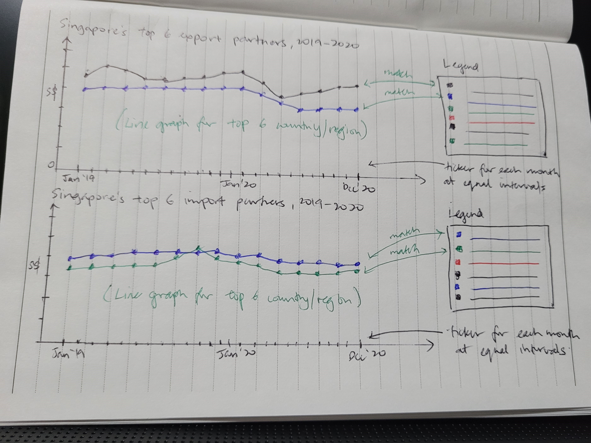
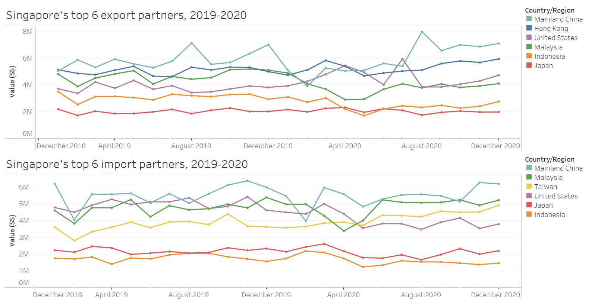

```{r setup, include=FALSE}
knitr::opts_chunk$set(echo = FALSE)
```
## 1 Critic
We will critic the following data visualisation based on clarity and aesthetic.


### 1.1 Clarity

1. The data visualisation mentions “top six trading countries” without defining what it means – it could refer to either countries Singapore exports the most to, imports the most from, or with the largest net value of export and import.
2. The order of the graphs in 2 rows of 3 provides no information on the rank of each trading country.
3. The overlapping shaded areas under the line graphs makes it difficult to read the values of import and export for each country.
4. The x-axis on the graph for Japan is incorrect because it only shows one period of 2020.
5. “Month of period” for the x-axis sounds awkward. Each tick on the x-axis could simply indicate the “Month Year”.

### 1.2 Aesthetic

1. The grid lines on the y-axis are too light and it is therefore difficult to read the exact import and export values.
2. The absence of ticks on the x-axis of time makes reading the graphs difficult. The ticks should be in the middle of the period (month).
3. The width for x-axis (months) are not standardised across all six graphs. Since some graphs are wider than the rest, it is difficult to compare trends or patterns across countries.
4. The dual y-axis for values of exports and imports makes it difficult to determine the exact import and export values. For example, when you look at the Dec 2020 value of export to the US, the line of vision to trace back to the relevant y-axis on the left is challenging.

## 2 Alternative data visualisation
We propose an alternative data visualisation to strengthen the visualisation in terms of clarity and aesthetics.

### 2.1 Sketch
A brief sketch of the proposed alternative data visualisation is as follows:



### 2.2 Advantages of alternative data visualisation
It would be more meaningful to look at merchandise exports and imports separately because how much Singapore exports to or imports from a specific country/region depends on different export and import policies.

For merchandise exports, we will plot a line graph for the export values of six countries that Singapore exports merchandise to the most between 2019 to 2020. A single y-axis for the export value makes it easier to compare Singapore’s export trends across the six countries during the two year period.

For merchandise imports, we will adopt a similar method as merchandise exports.

The proposed visualisation clearly distinguishes the top six countries/regions that Singapore exports from the top six countries/regions that Singapore imports from.

The dot points for each month makes it easier to read the import and export values. Also, the legend is arranged in the same order as the rank of the countries/regions as at Dec 2020 for ease of reading.

### 2.3 Proposed data visualisation (in Tableau)
Using Tableau 2021.1, the alternative data visualisation is available for viewing in [Tableau Public](https://public.tableau.com/app/profile/nurulasyiqah.md.taha/viz/top6traders/Top6tradepartners/). A snapshot of the dashboard is as follows:



## 3 Guide to prepare data visualisation
Download the dataset from the Department of Statistics Singapore's website on [Merchandise Trade](https://www.singstat.gov.sg/find-data/search-by-theme/trade-and-investment/merchandise-trade/latest-data/). Expand the "Merchandise Trade by Region/Market" tab and click on "Download all in Excel". Retain the file name as "outputFile.xlsx".

### 3.1 Data preparation in Tableau Prep
Open Tableau Prep Builder 2021.1 and click on "Connect" -> To a File: Microsoft Excel.


Check the "Use Data Interpreter" box to perform preliminary cleaning on the dataset.


Click and drag "T1" table into the workspace. Right click and rename it to "Imports".


Click on the "+" sign beside "Imports" and select "Add clean".


Remove all "Fields" before Jan 2019 and after Dec 2020.


### 3.2 Data preparation in Microsoft Excel


### 3.3 Creating line graphs in Tableau
Testing testing


### 3.4 Creating dashboard in Tableau
Testing testing


## 4 Three major observations
Based on the alternative data visualisation, we made the following observations:

### 4.1 Observation 1
Testing testing

### 4.2 Observation 2
Testing testing

### 4.3 Observation 3
Testing testing

Distill is a publication format for scientific and technical writing, native to the web.

Learn more about using Distill at <https://rstudio.github.io/distill>.


