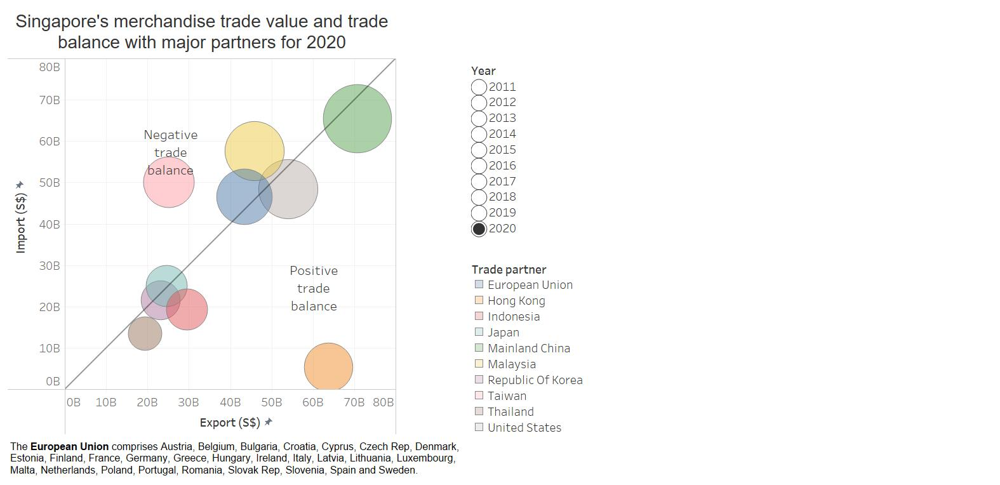

```{r setup, include=FALSE}
knitr::opts_chunk$set(echo = FALSE)
```
## 1 Critic
We will critic the following data visualisation based on clarity and aesthetic.

](image/original.jpg)

### 1.1 Clarity

* **The visualisation lacks a main title.** User must click on the source link of the visualisation to access the original visualisation on the Department of Statistics, Singapore website to learn that the visualisation is of merchandise trade performance with major trading partners in 2020. Ideally, the static visualisation should include the title so that the user can understand at one glance the purpose and scope of the visualisation, instead of having to read the notes or click to the original visualisation webpage.
* **Lack of definition for “Total merchandise trade value”.** “Total merchandise trade value” is not clearly defined as the sum of export value and import value, for each trading partner. This should be distinguished from “trade balance”, which is the difference between export value and import value, for each trading partner.
* **The shaded regions “Net Exporters” (in green) and “Net Importers” (in blue) are misleading.** The note to the visualisation explains that “if the value of imports exceeds exports, the centre point of the bubble falls in the “Net Importers”… blue region”. Take for example Taiwan - intuitively, if Singapore’s value of imports from Taiwan exceeds the value of exports to Taiwan, Taiwan is a net exporter to Singapore and should not be labelled as a net importer. Conversely, if Singapore’s value of exports to Hong Kong exceeds the value of imports from Hong Kong, Hong Kong is a net importer from Singapore and should not be labelled as a net exporter. Therefore, the shaded regions should be revised to “Net exports from Singapore” (in green) and “Net imports from Singapore” (in blue)
* **Lack of definition for EU.** Nine of the trading partner bubbles refer to Singapore’s trading partner countries or regions but “EU” is the only bubble that is an aggregation of merchandise trade with 27 countries in the European Union. While we can appreciate the relevance of comparing the European Union as a trading partner vis-à-vis the other nine countries, the member countries of the European Union should be clearly listed. 
* **Missing units for both axes.** The graph is missing the basic requirement for axes to be clearly labelled with the counting unit. User must look at the bubble annotations to understand that the axes are in billion Singapore dollars.
* **Unclear context of information box.** At the bottom of the visualisation, there is an information box commenting on the trend of exports exceeding imports with Mainland China since 2009 and trend of imports exceeding with the United States since 2006. This information is not meaningful for the user reading the static visualisation for 2020. It would be more meaningful to include at least the 2006 and 2009 data for visualisation with a slope graph.

### 1.2 Aesthetic

* **Smaller bubbles hidden by larger bubbles.** The “total merchandise trade value” bubbles are too opaque so trading partners with smaller total merchandise trade values are hidden behind those with larger total merchandise trade values. By making the bubbles more translucent, they can overlap each other while remaining at their respective positions on the graph.
* **Labels of both axes are not intuitive.** The labelling of “Exports” and “Imports” axes with icons at the zero-origin are confusing. User has to double-check that the label “Exports” refer to the x-axis and “Imports” refer to the y-axis. Typically, the word “Export” should appear along the x-axis and “Imports” along the y-axis for ease of reading and simple intuition.
* **Absence of reference lines.** It is challenging for user to read the export and import value of a specific trading partner. Even when user hovers pointer over the original interactive visualisation to bring forward the bubble (e.g. European Union), it is still difficult to read the exact export and import values.

## 2 Alternative data visualisation
We propose an alternative interactive data visualisation to strengthen the visualisation in terms of clarity and aesthetics.

### 2.1 Sketch
A brief sketch of the proposed alternative data visualisation is as follows:


### 2.2 Advantages of alternative data visualisation

* **Graphical design principles**
    + A dynamic title is given to the visualisation, which follows the “Year” radio button when toggled.
    + The axes are labelled per normal convention to avoid confusion for the user.
    + The top left triangular region of the graph is labelled as “Negative trade balance” and the bottom right triangular region of the graph is labelled as “Positive trade balance”. This is to mitigate the “Net importers” and “Net exporters” confusion created by the original visualisation.
    + The “trade value” bubbles are more translucent such that smaller bubbles are not hidden by larger bubbles.
    + Reference lines are added if user wishes to estimate the exact export or import value Singapore made with a trade partner. Otherwise, the user may rely on tooltips for detailed information.
    + A note is added at the bottom of the visualisation that unlike the other nine trade partners, the European Union comprises 27 countries.
* **Statistical graphic methods**
    + The “trade value” bubbles are now proportionally-sized, unlike the original visualisation that exaggerated the trade value of Mainland China in relation to the other trade partners.
* **Interactive techniques (including animation)**
    + Tooltips are provided such that when user hovers over the edge of a “trade value” bubble, detailed information on Singapore’s trade value and trade balance.
    + We have incorporated a slow-speed animation for user to see the trade value bubble for a trade partner change in relative size and position on the graph when the user toggles the “Year” radio buttons. User can also see more than one trade partner’s movement each time the “Year” radio button is toggles and this facilitates a convenient high-level comparison of trade partners.

### 2.3 Proposed data visualisation (in Tableau)
Using **Tableau 2021.1**, the alternative data visualisation is available for viewing in [Tableau Public](https://public.tableau.com/app/profile/nurulasyiqah.md.taha/viz/SingaporeMajorTradePartners/Tradevalueandbalance). A snapshot of the dashboard is as follows:



## 3 Step-by-step guide to prepare data visualisation
Download the dataset from the Department of Statistics Singapore's website on [Merchandise Trade](https://www.singstat.gov.sg/find-data/search-by-theme/trade-and-investment/merchandise-trade/latest-data/). Expand the "Merchandise Trade by Region/Market" tab and click on "Download all in Excel". Retain the file name as "outputFile.xlsx".

### 3.1 Data preparation in Tableau Prep

Open **Tableau Prep Builder 2021.1** and click on "Connect to data" button. Next, select "To a File: Microsoft Excel".

{width=50%}
{width=50%}

Locate the unzipped file "outputFile.xlsx" and click OK.

{width=50%}

Check the “Use Data Interpreter” box to perform preliminary cleaning on the dataset.

{width=30%}

Click and drag “T1” table into the "Add Data" workspace. Right-click on the "T1" node and rename it to “Import”.


Click on the "+" button of the "Import" node and select "Clean Step".


As we only require data from 2011 to 2020:

* Click on "1976 Jan" column, press "shift" key and click on "2010 Dec" column. Right-click on "2010 Dec" column and select "Hide Fields".
* Click on "2021 Jan" column, press "shift" key and click on "2021 Apr" column. Right-click on "2021 Apr" column and select "Hide Fields".


To extract the country/region name, click on the “drop-down” arrow of the “Variables” field -> Split Values -> Automatic Split.


Click on the "drop-down" arrow of the "Variables - Split 1" field  -> Rename Field. Rename the column to "Trade partner". Right-click on "Variables - Split 2" and "Variables" fields to remove them as they are redundant.


To keep only the 10 major trade partners, click on the 'drop-down" arrow of the "Trade partner" field -> Filter -> Selected Values. Check the boxes for the 10 trade partners and click the "Done" button.


To transpose the data from a wide form to a long form, click on the "+" button of the "Clean 1" node and select "Pivot". Select all the month fields and drag them into the "Pivoted Fields" section.


Right-click on "Pivot1 Values" field to rename it to "Import". Right-click on "Pivot1 Names" field to rename it to "Month" and click on the "ABC" button to change the field type to "Date".


Repeat all the steps above for T2. Rename "Pivot Values" field to "Export"


To perform a full join for both Import and Export tables, click on the "+" button" of "Pivot1" node and select "Join". Click and drag "Pivot3" node into "Add" of the "Join" node. For the "Join Settings":

* Applied Join Clauses: Select "Trade partner" and "Month"
* Join Type: Select "full"


Click on the "+" button of "Join 1" node to add a "Clean Step". Click on "Month-1" field, press "Ctrl" key, click on "Month" field, right-click and select "Merge". Do the same to merge "Trade partner-1" and "Trade partner" fields.


Click on the ‘+’ button of the “Clean 3” node and select “Output” to save the output as a “tradepartners.csv” file.


### 3.2 Creating bubbleplot in Tableau
Open **Tableau 2021.1**. Click and drag "tradepartners.csv" into the workspace.

In "Sheet 1", start by building the foundation scatter plot:

* Click and drag "Export" pill into "Column"
* Click and drag "Import" pill into "Row"


Click and drag the "Month" pill into the "Filters" pane. Select "Years" and click "Next". Click "All", "Apply" and "OK".

{width=30%)}{width=30%}


### 3.3 Creating dashboard in Tableau
Click on "New dashboard" tab. Click and drag the "Export" and "Import" sheets into the dashboard. Realign the items on the dashboard so that everything is clear. Select "Automatic" as the size.

## 4 Three major observations

### 4.1 

### 4.2

### 4.3


Distill is a publication format for scientific and technical writing, native to the web.

Learn more about using Distill at <https://rstudio.github.io/distill>.


