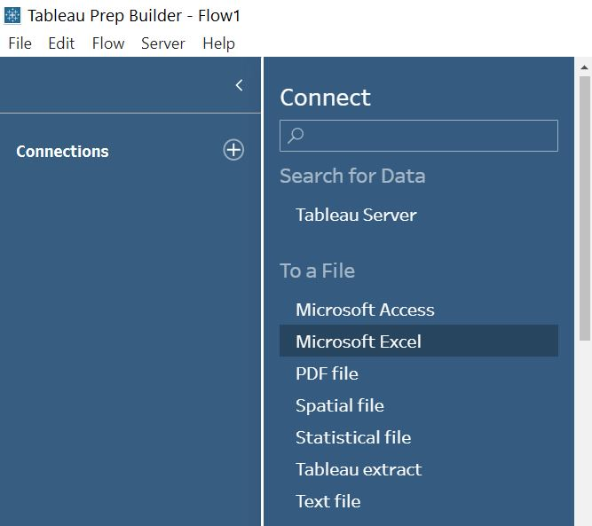

```{r setup, include=FALSE}
knitr::opts_chunk$set(echo = FALSE)
```
## 1 Critic
We will critic the following data visualisation based on clarity and aesthetic.


Source: [Department of Statistics, Singapore](https://www.singstat.gov.sg/modules/infographics/singapore-international-trade)

### 1.1 Clarity

### 1.2 Aesthetic

## 2 Alternative data visualisation
We propose an alternative data visualisation to strengthen the visualisation in terms of clarity and aesthetics.

### 2.1 Sketch
A brief sketch of the proposed alternative data visualisation is as follows:

### 2.2 Advantages of alternative data visualisation

### 2.3 Proposed data visualisation (in Tableau)
Using Tableau 2021.1, the alternative data visualisation is available for viewing in [Tableau Public](). A snapshot of the dashboard is as follows:

## 3 Step-by-step guide to prepare data visualisation
Download the dataset from the Department of Statistics Singapore's website on [Merchandise Trade](https://www.singstat.gov.sg/find-data/search-by-theme/trade-and-investment/merchandise-trade/latest-data/). Expand the "Merchandise Trade by Region/Market" tab and click on "Download all in Excel". Retain the file name as "outputFile.xlsx".

### 3.1 Data preparation in Tableau Prep

Open Tableau Prep Builder 2021.1 and click on "Connect to data" button. Next, select "To a File: Microsoft Excel".

{width=50%}
{width=50%}

Locate the unzipped file "outputFile.xlsx" and click OK.

{width=50%}

Check the “Use Data Interpreter” box to perform preliminary cleaning on the dataset.

{width=30%}

Click and drag “T1” table into the "Add Data" workspace. Right-click on the "T1" node and rename it to “Import”.


Click on the "+" button of the "Import" node and select "Clean Step".


As we only require data from 2011 to 2020:

* Click on "1976 Jan" column, press "shift" key and click on "2010 Dec" column. Right-click on "2010 Dec" column and select "Hide Fields".
* Click on "2021 Jan" column, press "shift" key and click on "2021 Apr" column. Right-click on "2021 Apr" column and select "Hide Fields".


To extract the country/region name, click on the “drop-down” arrow of the “Variables” field -> Split Values -> Automatic Split.


Click on the "drop-down" arrow of the "Variables - Split 1" field  -> Rename Field. Rename the column to "Trade partner". Right-click on "Variables - Split 2" and "Variables" fields to remove them as they are redundant.


To keep only the 10 major trade partners, click on the 'drop-down" arrow of the "Trade partner" field -> Filter -> Selected Values. Check the boxes for the 10 trade partners and click the "Done" button.


To transpose the data from a wide form to a long form, click on the "+" button of the "Clean 1" node and select "Pivot". Select all the month fields and drag them into the "Pivoted Fields" section.


Right-click on "Pivot1 Values" field to rename it to "Import". Right-click on "Pivot1 Names" field to rename it to "Month" and click on the "ABC" button to change the field type to "Date".


Repeat all the steps above for T2. Rename "Pivot Values" field to "Export"


To perform a full join for both Import and Export tables, click on the "+" button" of "Pivot1" node and select "Join". Click and drag "Pivot3" node into "Add" of the "Join" node. For the "Join Settings":

* Applied Join Clauses: Select "Trade partner" and "Month"
* Join Type: Select "full"


Click on the "+" button of "Join 1" node to add a "Clean Step". Click on "Month-1" field, press "Ctrl" key, click on "Month" field, right-click and select "Merge". Do the same to merge "Trade partner-1" and "Trade partner" fields.


Click on the ‘+’ button of the “Clean 3” node and select “Output” to save the output as a “tradepartners.csv” file.


### 3.2 Creating bubble plots in Tableau
Open Tableau. Click and drag "__________" into the workspace.


### 3.3 Creating dashboard in Tableau
Click on "New dashboard" tab. Click and drag the "Export" and "Import" sheets into the dashboard. Realign the items on the dashboard so that everything is clear. Select "Automatic" as the size.

## 4 Three major observations

### 4.1 

### 4.2

### 4.3


Distill is a publication format for scientific and technical writing, native to the web.

Learn more about using Distill at <https://rstudio.github.io/distill>.


